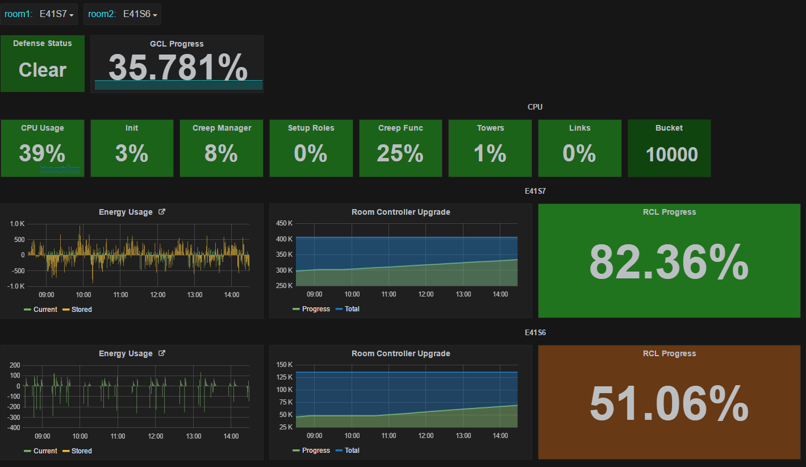

# screeps-grafana

Pretty graphs for Screeps stats. 


There are two ways to get started:

## Path 1: Easy but not robust
You can run this project locally, with all the drawbacks that entails.

Install [docker](https://docs.docker.com/engine/installation/)

Install [docker-compose](https://docs.docker.com/compose/install/)

Copy and edit the example config file:

```
cp docker-compose.env.example docker-compose.env
$EDITOR docker-compose.env
```

Run the setup:

```
bash setup.sh
```

Go to http://localhost:1337 in your browser, then see Usage below.

## Path 2: Robust but not easy

Acquire a server, I use a t2.micro from Amazon Web Services. You can use anything running ubuntu with passwordless sudo.

Open ports 80 and 81 in your security groups.

***SUPER IMPORTANT: MAKE SURE TO MOUNT A DATA VOLUME TO /dev/sdf IN THE AWS CONSOLE. IF YOU FAIL TO DO SO, YOUR DATA AND DASHBOARDS WILL BE LOST IF THE SERVER RESTARTS, THEN YOU WILL BE HELLA SALTY, AND I'LL JUST CROSS MY ARMS AND SAY "I TOLD YOU SO IN BOLDED ITALICS"***

Install [ansible](http://docs.ansible.com/ansible/intro_installation.html).

Create a password for your screeps account if you haven't already.

You're now ready to run this whale of a command. Replace the stuff in caps with values that makes sense

```
ansible-playbook \
  -e screeps_username=YOURUSERNAME \
  -e screeps_password=YOURPASSWORD \
  -e screeps_email=YOUREMAIL \
  --user ubuntu \
  -i ,YOURSERVERIP \
  playbook.yml
```

**Don't remove the comma before `YOURSERVERIP`. You will get a mysterious error. If you pass your IP like `,12.34.56.78` you are doing it correctly.**

If the run errors out, check your parameters and retry. It is common to see transient errors from Apt or GPG, which are both fixed by re-running.

You are now ready to use grafana!

## Usage

Go to http://localhost:1337 or your own real-life server's IP. Login with the following default credentials:
NOTE: On Windows running Docker Toolbox use http://192.168.99.100:1337 instead

```
username: admin
password: admin
```
You are now ready to [create some dashboards](https://www.youtube.com/watch?v=OUvJamHeMpw).

To use the Sample Dashboard, copy the contents of [stats.js](stats.js)
A sample dashboard is already installed that displays the stats from [stats.js](stats.js)


To send stats to the dashboard, simply write them to `Memory.stats`. For example:

```
Memory.stats["room." + room.name + ".energyAvailable"] = room.energyAvailable;
Memory.stats["room." + room.name + ".energyCapacityAvailable"] = room.energyCapacityAvailable;
Memory.stats["room." + room.name + ".controllerProgress"] = room.controller.progress;
```
All values on the `Memory.stats` object are forwarded to Grafana verbatim.

## Adding Grafana plugins
Just run 
`docker-compose exec grafana grafana-cli plugins install grafana-clock-panel`
to install the plugins, then 
`docker-compose restart grafana`
to apply. Refresh your browser and voila!

## Advanced configuration

### Alternative (Basic HTTP) Authentication

To read stats from a private server, you must use the option `screeps_basic_auth=1`
and pass the additional setting `screeps_hostname` which should use the `http` protocol,
use your private server's hostname or IP, and use the screep server port (by default
`21025` unless your server changed it).

The value of `SCREEPS_BASIC_AUTH` determines how Grafana will try to login to the Screeps server.  

If it's `0` the default mechanism used by the official server will be used. If it is `1` an alternative
mechanism is used, using HTTP Basic Authentication. This method is required by some private server mods
such as [screepsmod-auth](https://github.com/ScreepsMods/screepsmod-auth).

```
ansible-playbook \
  -e screeps_basic_auth=1 \
  -e screeps_hostname=http://your.private.server.name:21025 \
  -e screeps_username=YOURUSERNAME \
  -e screeps_password=YOURPASSWORD \
  -e screeps_email=YOUREMAIL \
  --user ubuntu \
  -i ,YOURSERVERIP \
  playbook.yml
```


## Important Development Notes

If you're modifying `screeps-grafana` and wanting to test your changes, you'll want
to know the following:

After you make changes to your own fork of this repository, you will need to generate
a docker image, publish it to Docker Hub and modify `docker-compose.yml` to use your own
custom docker image rather than `screepers/screeps-statsd`.

Where `YOU` is your [Docker Hub](https://hub.docker.com) username:

```bash
sudo docker build -t YOU/screeps-statsd .
sudo docker login -u YOU -p YOUR_DOCKER_HUB_PASSWORD
sudo docker push YOU/screeps-statsd
```

After completing these steps, your new custom image `YOU/screeps-statsd` will exist
on Docker Hub and you can use it.

Add `-e screeps_node_image=YOU/screeps-statsd` to the `ansible-playbook` command line
to use your own Docker Hub image instead of the default.

Each time you want to test new changes, you need to `docker build`, `docker push`
and then `ansible-playbook` to update your container with your new code.


## License

This software is licensed under the **MIT License**. See the [LICENSE](LICENSE) file for more information.
